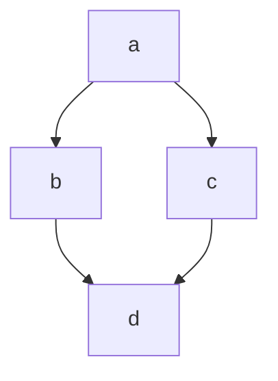

> 对应于 *C++ primer* 的CH15，CH18的部分内容

## OOP（objec-oriented programming）

面向对象程序设计(oop)的核心思想是数据抽象，继承和动态绑定(类似于java中的封装，继承和多态)。

### 数据抽象回顾

C++中的自定义数据类型（也就数据的抽象）具有高度的可定制性，你可以自己决定对象的各种属性和行为，包括但不限于：

- 有哪些数据成员
- 有哪些行为方法
- 对象的各个部分的访问权限控制
- 定义该对象的时候会发生什么
- 销毁该对象的时候会发生什么
- 对象怎么进行赋值
- 对象的内存怎么被移动，接管
- 对象怎么进行算数和逻辑运算

虽然（相比较java）在C++中类的设计者对对象的控制权十分巨大，但也不要玩脱了。所谓：

> 正确的不一定是好的。


## 继承(inheritance)

### 继承中的成员函数

基类中的成员函数有两种：

- 希望派生类继续使用不修改的
- 希望派生类对基类的进行覆盖(override)的(但是子类并不一定非要覆盖)

称后者为**虚函数**,用`vitual`关键字进行声明

```c++
vitual returnType xxxx(){
    
}//虚函数，希望子类进行重写

return type xxx(){
    
}//非虚函数，希望子类进行保持
```

虚函数具有**动态绑定（dynamic binding）**的特性：**基类的指针或者引用会根据其具体引用或者指向的对象类型而调用不同的函数**，这一点对于析构函数也是适用的，因此基类的析构函数一般定义为虚析构函数

### 定义派生类

```c++
class A{};
class B{};
..
class B:public A,private B...{

}
```

继承的基类不止一个的时候称为**多继承**，下面目前只讨论公有单继承

#### 派生类的构造函数

派生类派生而来的成员需要通过基类的构造函数进行初始化

```c++
Bulk_quote(const std::string &book,double sales_price,std::size_t t,double xx)
    :Quote(book,sales_price),min_gty(t),discount(xx){}
```

#### 指向派生类的基类指针(引用派生类的基类引用)

```c++
Quote A;
Bulk_Quote b;
Quote *p = &b;
Quote &re = b;

```

这样的转换通常成为**派生类到基类的（derived-base）**转换

#### 派生类使用基类成员

派生类可以无障碍地使用基类的`public`和`protectd`成员

#### 定义无法作为基类的类

```c++
class A final{
//被final下修饰的类不能被继承（类似java）
};
```

### 类型转换和继承

当使用基类的引用（或者指针）的时候，我们并不清楚该引用或者指针上所绑定的对象的实际类型（不清楚是基类类型还是派生类的类型）

#### 静态类型和动态类型

- 表达式的静态类型在编译的时候总是已知的，它是变量声明时的类型或者表达式生成的类型
- 动态类型是变量在**内存**中的实际类型

动态类型和静态类型的不同**仅仅发生在表达式是引用或者指针**的情况下。

```c++
Bulk_Quote b;
Quote *p = &b;
//p的静态类型是Quote*,动态类型是Bulk_Quote*s
```


但是却**不能让派生类引用或者指针引用或者指向静态类型是基类的变量，不管该变量的动态类是是不是派生类**


## 虚函数

### 对虚函数的调用在运行的时候才被解析

到底是执行派生类还是基类的成员函数看的是变量的动态类型而不是静态类型，这也是叫动态绑定的原因之一。这一决定过程是在运行的时候才进行的。类的这样的行为也成为**多态（polymorphism）**

> C++的"动态"好多时候都与“运行时”有关？

### 派生类中的虚函数

> 当我们在派生类中覆盖了某个虚函数的时候，可以再一次使用`vitural`关键字指出该函数的性质，但是这么做并非必须的，因为一旦一个函数被声明为虚函数，则所有派生类中它都是虚函数

## 抽象基类

类似于java中的抽象类，我们在类中**只声明而不定义**某些成员函数而让其派生类去实现，这样的类叫抽象基类

```c++
returnType xxx(parameters_list)=0;//声明一个抽象函数
```

包含是上述函数的类即为抽象基类，因为抽象基类中的某些方法没有实现，因此不能直接创建抽象基类的对象。

## 多重继承

从多个基类派生出一个类称之为**多重继承**，派生类对象中包含每个基类的所有子对象。

```C++
class A :public B,public C{

}
```

### 继承的构造函数与多重继承

C++11以后允许派生类从它的一个或几个基类中继承构造函数。但是这些继承的构造函数不能相同a，否则报错。  

## 虚继承

虽然C++禁止同时继承一个类多次，但是其多继承机制会让一个类间接的继承另一个类多次(如下图，b,c都继承了a,而d继承了b和c,因此b间接地继承了a两次)，为了解决这个问题而提出了**虚继承**



当b,c两类虚继承a类的时候该问题可以得到解决。

```c++
class b:vitural public a{

} //基类的虚继承
```

`virtual`说明了一种愿望，即在后续的派生类中共享虚基类中的同一份实例。

> 关于多重继承和虚继承的更多细节目前就打住吧，因为对我个人而言实在是用处太少。