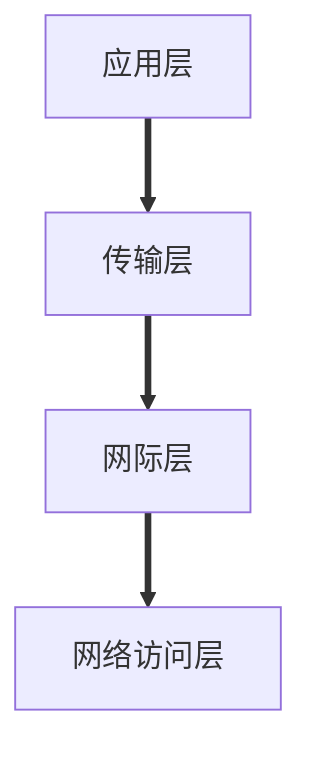
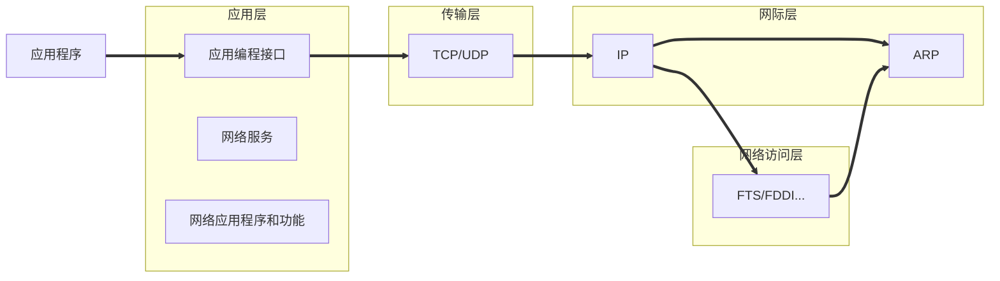

## 什么是TCP/IP

### 网络和协议

网络协议是一套通用的规则系统，用来帮助定义网络通信的复杂过程,TCP/IP协议（标准）定义了网络通信的过程。TCP/IP的实现是软件组件，计算机通过这个软件参与到TCP/IP网络中

### 特性

TCP/IP要解决的问题：

- 逻辑编址
- 路由选择
- 名称解析
- 错误控制&流量控制
- 应用支持

### RFC文档

TCP/IP的大多数官方文档是通过一系列的RFC形式发布的。

## TCP/IP的工作方式

### 负责完成的任务

- 把信息分解成可管理的协议块，并且这些数据块能有效地通过传输介质
- 与网络适配器进行硬件连接
- 寻址，即发送端必须能定位到接收端的计算机
- 把数据路由到计算机所在的子网
- 执行错误控制，流量控制和确认
- 从应用程序接受数据并传输到网络
- 从网络接受到数据并传输到应用程序

### 描述TCP/IP的一种四层模型

网络访问层：提供了与物理网络连接的接口

网际层：提供独立于硬件的逻辑地址（IP）

传输层：为网络提供了流量控制，错误控制和确认服务，充当网络与应用程序的接口

### TCP/IP和OSI模型

TCP/IP没有遵守OSI模型，但是这两种模型有类似的目标

OSI的七层模型：

应用层==>表示层==>会话层==>传输层==>网络层==>数据链路层==>物理层

### 数据包

数据包每经过一层就会被添上一定的信息。

数据包在每一层具有不同的形式和名字:

应用层：消息

传输层：分段（TCP）,数据段（UDP）

网际层：数据报

网络访问层：帧

