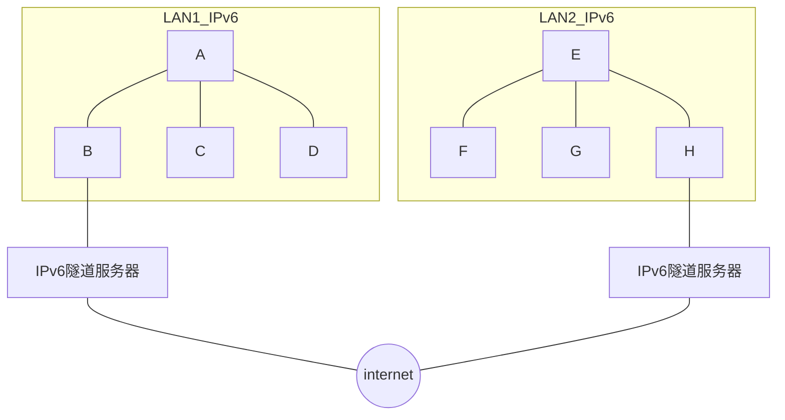

## TCP/IP安全

### 防火墙

防火墙是一个放置在网络路径上的设备，可以检查，接受或者拒绝进入网络的数据包。防火墙可以配置特定的安全规则。

### 攻击技术

#### 计算机攻击者

主要有以下几类：

- 青少年业余爱好者
- 消遣性入侵者
- 专业人士

#### 入侵技术的基本分类

- 证书攻击
  - 从计算机之外的地方获取密码
  - 特洛伊木马
  - 猜测（密码）
  - 窃听
- 网络层攻击
- 应用层攻击

##  配置

### 服务器提供IP地址的状况

####  静态IP寻址

每一台计算机都已经预先配置了一个IP地址，并且能立即使用网络

缺点：

- 更多的配置工作
- 要消耗更多的地址
- 降低了灵活性

#### DHCP

是一种新的寻址系统，会通过基于DHCP协议的请求来分配IP。DHCP服务器可以向DHCP客户端提供一组TCP/IP配置，比如IP地址，子网掩码和DNS服务器地址等等。

### DHCP寻址系统

#### 工作过程

1. DHCP客户端向UDP短暂687广播发送数据报（包含了客户端的物理地址），任何收到这个数据报的服务器都能响应这个请求。
2. DHCP服务器会为客户端提供可租用的地址，并构建响应数据报（包含了可以提供给客户端的IP,子网掩码等等）通过广播发送给该客户端，如果多个服务器都发送响应数据报，客户端通常只接收第一个。
3. 客户端收到响应后会再广播一次，通知DHCP服务器收到/未收到DHCP服务器提供的信息。
4. 接受的服务器会最后发送一个ACK数据报，同时也会附加一些额外信息。

### NAT(网络地址转换)

DHCP服务器提供的IP不需要再因特网上唯一，而只是在本地网络上有效即可。这时候路由器充当只有局部IP（内网）的代理，代替客服端进行收发数据报，这样的服务称为（网络地址转换）

### 零配置

略。。

## IPv6

### 背景

IPv4地址已经耗尽了，一直在靠各种技术苟着，换新的地址系统是必然的趋势。

IPv6的目标：

- 扩展寻址能力
- 更简单的报头格式
- 提升了对扩展和选项的支持
- 流标签
- 提升身份认证和隐私保护的能力

### IPv6的报头

#### 报头格式

- 版本（4）
- 流量类别（8）
- 流标签（20）
- 载荷长度（16）
- 下一个报头（8）
- 跳数限制（8）
- 源地址（128）
- 目的地址（128）

#### 扩展报头

- 逐跳选项（将传输路径上路由器的可选信息关联起来）
- 目的选项（将可选信息与目的节点关联）
- 路由(指定数据报在传输过程中的一个或者多个路由器)
- 分段（ 重组分段的数据报所需的定位信息）
- 身份认证（提供安全和身份认真信息）
- 有效载荷安全封装

### IPv6的寻址

| 地址类型     | 地址           | 描述                 |
| ------------ | -------------- | -------------------- |
| 未指定       | ::/128         | 未被分配             |
| 环回         | ::1/128        | 用于向本机发送数据报 |
| 映射后的ipv4 | ::FFFF/96      | 与现有ipv4对应的IPv6 |
| 多播         | FF00::/8       | 表示一组主机         |
| 链路本地单播 | FE80::/19      | 用于自动地址配置     |
| 全局单播     | 所有的其它地址 |                      |

> ::表示全0

### IPv6隧道

目前使用IPv6隧道技术来实现IPv6地址之间的通信（Internet还是IPv4网络）,如同所示：

## 加密，跟踪&隐私

### 加密和保密

安全系统满足的基本要求：

- 对数据进行加密
- 确保数据来自于他产生的源头
- 确保数据在传输过程中未被篡改

#### 算法和密钥

加密或者解密的过程必须分为以下两个过程

1. 一个标准的，可重复可复制的部分（始终相同）---加密算法
2. 一个独一无二的部分（在双方之间加强一个加密关系）--- 加密密钥

#### 对称加密

对称加密的中加密和解密使用相同的密钥，下面是基本的过程：

- 创建一个双方计算机都知道的密钥
- 发送方使用预定的加密算法和密钥对要发送的数据进行加密
- 加密的数据被传目的计算机
- 目的计算机使用密钥和解密算法对数据进行解密

#### 非对称加密

非对称加密中加密和解密的密钥不同,一个称为共有密钥,一个称为私有密钥(私有密钥在接收者计算机上(本例子中是B))

- 计算机A尝试与计算机B建立连接(B有私有密钥)
- B向A发送公开密钥
- A使用B给的公开密钥加密并且传输数据
- B接收到数据后用私钥进行解密

#### 数字签名

数字签名用来确定数据所属的数据源,并且该数据在传输过程中未被篡改

- 计算机A要向计算机B发送文档，会从文档中提前一小信息来执行某些数学计算，得到的结果称为鉴别码，A再使用私有密钥加密鉴别码，然后鉴别码和文档一起被发送给B
- B接受数据，用A提供的公开密钥来解密相应的鉴别码，从而判断数据源是不是来源于A

#### 数字证书

数字证书是公钥的一共加密副本.

### 保护TCP/IP

#### SSL和TLS

SSL是安全套接层协议，用于在传输层的套接字和通过那些套接字访问的网络之间提供一层安全,传输层安全**TLS**基于SSL3.0.

#### IPSec

TCP/IP网络上使用的另一种安全协议系统，在TCP/IP协议栈中运行，向网络应用提供基于加密的安全。

#### VPN

虚拟专用网络VPN可以建立一个横穿网络的“隧道”，用于保证普通TCP/IP流量的安全传播。