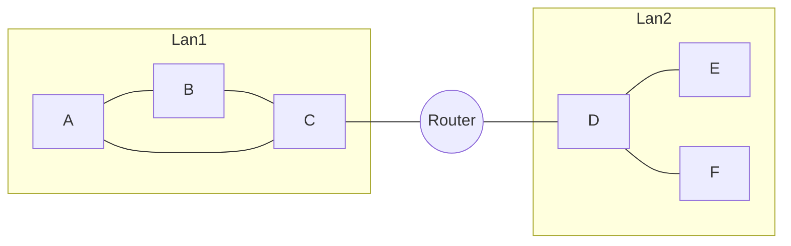
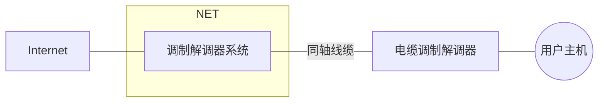
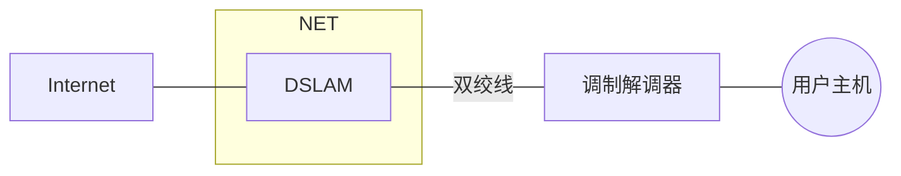
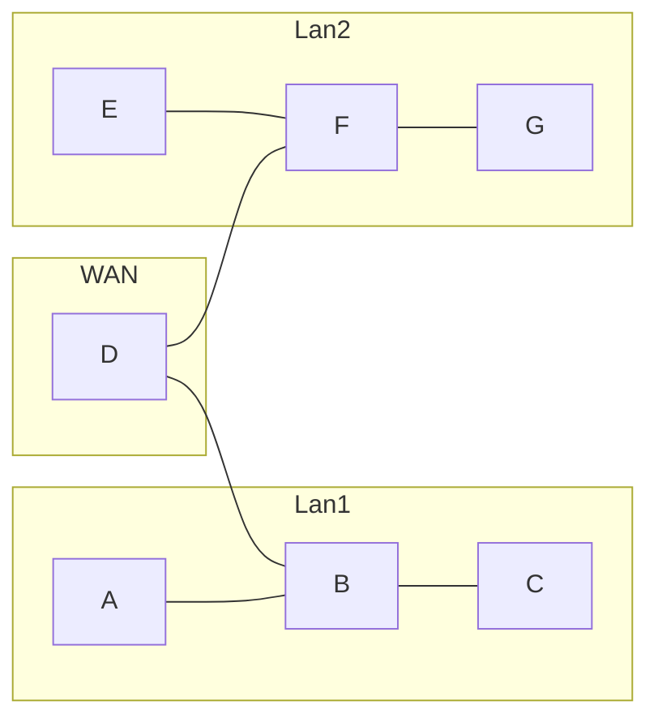
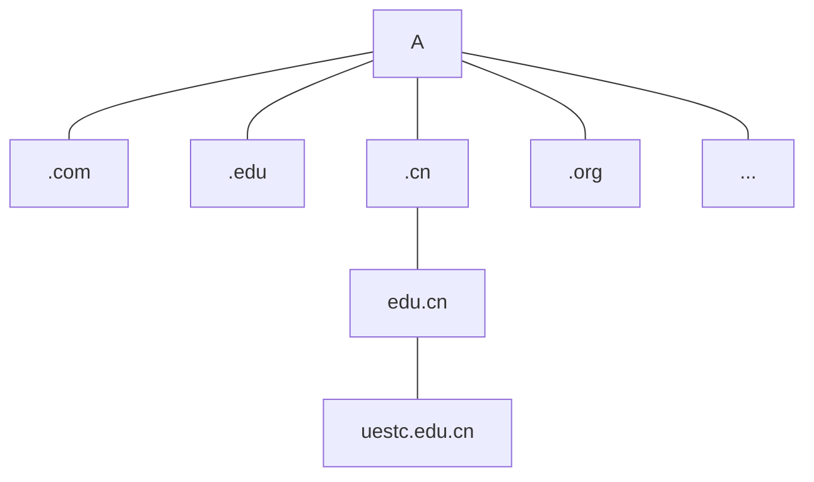

## 路由选择

### TCP/IP中的路由选择

#### 路由器

路由器是具有多个网络适配器（即多个IP地址）的专用计算机。（狭义的）路由器负责IP数据报在不同网络之间的转发。

路由器的职责：

- 路由器从所连接的网络之一接受数据
- 路由器把数据报传递到 协议栈的网际层（重组数据报）
- 路由器检查IP报头的目的地址
- 如果数据去往不同的网络，路由器根据路由表决定把数据转发给下一个路由器

路由器分类：

- 静态路由：由管理员手动输入路由信息
- 动态路由：根据路由协议获得的路由信息来动态建立路由表

#### 路由表

路由表是n行三列的表格，用来表示下一跳的位置

| 目的地址       | 下一跳          | 端口号（路由器不同网络适配器的接口号） |
| -------------- | --------------- | -------------------------------------- |
| 13.124.213.32  | 23.333.22.22    | 1                                      |
| 123.123.123.22 | 111.111.111.111 | 2                                      |

#### 路由转发协议

1. 距离矢量路由，典型算法是RIP算法
2. 链路状态路由，典型算法是OSPF算法

### 外部路由和内部路由

一个网络可以划分为多个自治子网络，因此产生了外部和内部路由的区别。

外部路由主要在自治网络之间交换路由信息，使用外部网关协议（EGP协议）

在自治网络内部共享路由信息的称为内部路由器，使用路由协议（RIP和OSPF等等）

## 连网

### 电缆宽带

两个调制解调器之间完成了信号的传输任务，完成了接入网络的过程(使用同轴线缆是一种节约资源的措施,不用铺设额外的网线)

### 数字用户线路(DSL)

该技术类似于电缆宽带,不过是在电话网络上铺设的网络

### 广域网(WAN)

## DNS
### what is DNS

DNS就是域名系统(domain name system).用于把域名转换为IP.

基本工作过程:客户端把域名发送给以一个域名服务器以获取IP地址,该服务器查到了就把IP地址发送给客户端,查不到就会把请求转发给其它域名服务器.

### DNS的名称空间设计

DNS的名称空间是一个多层排列的域,一个域就是一组计算机,这些计算机共享着名称空间的同一个部分(有相同的域名)域构成了一个域名树,树的顶端是ROOT节点,ROOT的子节点是一组顶级域:

一级一级的域名下来形成了一个域名链.一个域名服务器保存了它的子节点的域名解析信息.

### DNS的解析过程

- 主机1向服务器A发送查询,请求查找域名`uestc.edu.cn`

- A如果能找到该域名对应的IP,则把IP发送给1
- 如果A中没有这个地址,则把域名发送给`uestc.edu.cn`的顶级域名服务器`.cn`(B)
- B无法提供地址,就会把`edu.cn`的域名服务器(C)的信息发送给B
- A再向C请求
- ...循环上述过程
- 如果找到了该IP,服务器就把IP发给主机A,找不到就返回未找到.

### 名称服务器类型

#### 域和区域

再一组公共的DNS服务器上配置的DNS主机的集合成为区域,一个区域可能表示一个完整的域,也可能不是.域和区域的概念不是完全平行的,应注意区分.

- 作为子域的成员也是父域的成员
- 如果子域没有专门被委派,就不需要单独的域

#### 区域文件

区域文件是一个区域的DNS配置文件,区域文件是一个带有标准架构的文本文件,内容由多个资源记录构成,一个记录就是一行文本.

下面是常用的区域记录类型:

- SOA: 起始的授权机构
- NS:指定一个名称服务器
- A:把域名映射到IPV4地址
- AAAA:把域名映射到IPV6地址
- PTR:把IP地址映射到域名
- CNAME:把别名映射到一个由A记录表示的真实主机名